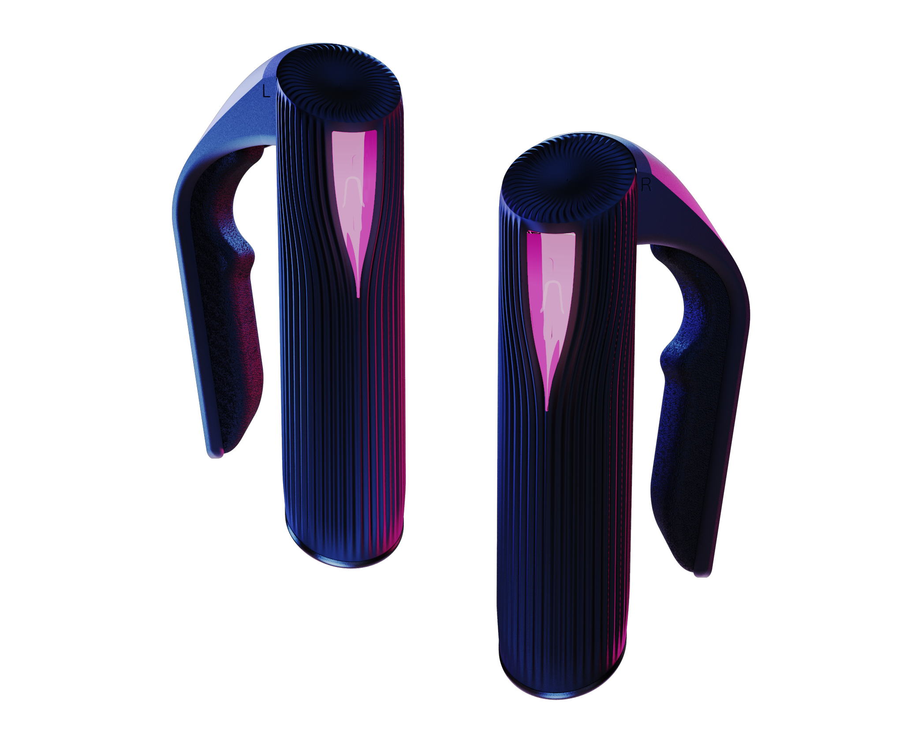
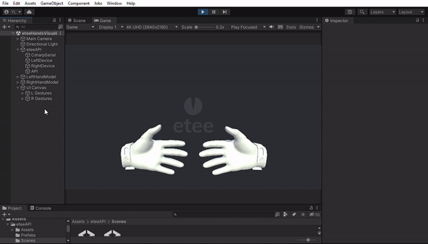
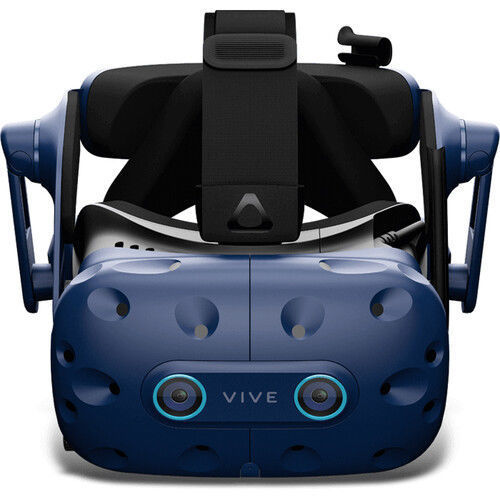

### Welcome to the Github Page of the Project  :  

### **`Influence of Social Anxiety on Embodied Face Perception During Affective Social Interactions Using EEG and VR`**  

### About the Project 🧠: 

_`⚡The aim of the project is to establish a biomarker of Social Anxiety by investigating EEG measurements of face and body perception within VR environment designed for social interactions.`_

### Explore the project through the following chapters 🚀: 

### Table of Contents:

1. [Introduction & Research Background](#introduction--research-background)
2. [Research Objectives](#research-objectives)
3. [Methodology](#methodology)
   - [3.1 General Methodology](#31-general-methodology)
   - [3.2 Neural Measures and Physiological Measures](#32-neural-measures-and-physiological-measures)
   - [3.3 State and Trait Anxiety Measures](#33-state-and-trait-anxiety-measures)
   - [3.4 Participants](#31-participants)
4. [Contribution](#contribution)

## 1. Introduction & Research Background

The defining characteristic of Social Anxiety Disorder (SAD) is intense fear or anxiety towards social situations where the individual may be exposed to scrutiny or negative evaluation by others (American Psychiatric Association, 2013). It is a highly prevalent disorder among the population, and it is considered as second most common DSM-IV disorder (Kessler et al., 2005). The median life prevalence and 12 months prevalence of SAD in Europe is 6.65% and %2, respectively (Fehm et al., 2005). Additionally, according to the National Comorbidity Survey Replication among adults in the USA between 2001-2003, the estimated lifetime and 12-month prevalence of social phobia are 12.1% and 7.1% respectively (Ruscio et al., 2008).
 
Common social scenarios that might trigger anxiety encompass situations like encountering unfamiliar individuals, talking in meetings or gatherings, starting conversations, interacting with people in positions of power, working, eating food or beverages in the presence of others, appearing in public and engaging in public speaking (NICE, 2013). Social anxiety is experienced by individuals along a spectrum (Rapee & Spence, 2004). Many young individuals report higher symptoms of social anxiety (Fehm et al., 2005). When the fears interfere with individual’s daily life and cause distress, it creates substantial difficulties in their functioning and may indicate the presence of the psychological disorder of SAD (APA, 2013). Recent studies have confirmed the relatively high prevalence of subclinical social anxiety symptoms among young people (Knappe et al., 2011, Rapee & Spence, 2004), which is indication of the need for further understanding of the assessment of the disorder.
 
 EEG is the method for recording the electrical changes in the group of neurons from the surface of the scalp (Kappenman & Luck, 2011) and it is effective on investigating the neural correlates of social anxiety. There are different EEG measures that can assess the biomarker of the SAD including Event-Related Potentials (ERPs) and Frontal Alpha Asymmetry. They collectively provide insights into the neural underpinnings of SAD by examining by heightened emotional response to social stimuli, attention allocation and emotion regulation. ERP refers to changes in voltage observed in continuous EEG recording, and these changes are time- and phase-locked with specific events, like the beginning of a stimulus or the response to a task (Kappenman & Luck, 2011). P1 and N170 components in ERP are associated with early stages of face processing and in various research they investigated as a response to faces. P1 component in ERP is typically appears after 100 milliseconds after the presentation of visual stimulus (Kappenman & Luck, 2011). It is related to early visual processing, and it is attention sensitive (Luck et al., 2000). The level of the attention an individual gives to the stimulus (Mangun, 1995), individual’s affective emotional judgement about the faces whether they find them favourable or unfavourable (Pizagalli et al., 1999) can result differences in the amplitude of the signal and the latency of the signal. Studies stated individuals with SAD displayed increased P1 amplitude for emotional faces (Kolassa et al., 2009) and emotional expressions (Kolassa et al., 2007) compared to neutral ones. Additionally, studies state  that P1 component is sensitive to threat and non-threat stimuli. Stimuli perceived as threatening to individuals prone to anxiety results in differentiations in P1 (Meynadasy et al., 2019).
 
The N170 component in ERP typically appears 170 milliseconds after the presentation of a visual stimulus. It is a face-specific ERP component, it is responsive to faces and mostly used in research focusing on face perception. There is contradictory previous literature about the association between N170 and emotional facial expressions that are not specific to SAD. Some studies resulted in an amplitude change for emotional facial expressions compared to neutral facial expressions (Aarts et al., 2012; Almeida et al., 2014; Bediou et al., 2009; Jiag et al., 2014; Lee et al., 2007; Yuan et al., 2014). In addition, a meta-analysis resulted in N170 being sensitive to emotional facial expressions. Anger, fear, and happy faces result in the greatest N170 amplitudes (Hinojosa et al., 2015). For studies focused on SAD, most of the studies revealed that there is no difference between the amplitudes of N170 for emotional faces and neutral faces for SAD compared to control group (Kolassa et al., 2007; Kolassa et al., 2009; Pechard et al., 2013). Contradictorily, one study revealed an increased N170 amplitude in the Stroop task for identifying angry faces (Kolassa & Miltner, 2006), and another study revealed that individuals with SAD exhibit decreased N170 amplitude for emotional facial expressions in the dot probe task (Mueller et al., 2009). Analysing N170 can show how individuals with SAD are sensitive to facial expressions that convey social information.
 
P2 and P3 are late ERP components, and they appear approximately 150-250 milliseconds and 300-500 milliseconds, respectively after the stimulus presentation (Luck, 2005; Polich, 2007). P2 component is related to selective attention and stimulus salience. Individuals with SAD tend to shift their attention towards social threats or possible negative evaluations about themselves and in social situations (Clark & Well, 1995), they tend to increase anxiety related thoughts and attentional biases which causes greater attention on negative stimulus (Matthews & Wells, 1996). Additionally, the P3 component is associated with social feedback. When the feedback evaluation is assessed, P3 represents the motivational significance of the feedback to an individual and their motivation to participate in social situations (Langston &Cantor, 1989). Increase in P3 component is related to attentional processes (Polich 2007), working load (Wang et al., 2015) and decision-making process (Rohrbaugh et al., 1974).  The P2 and P3 components are associated with difference in brain processes of SAD, and they do not represent early perceptual processes. Early ERP (such as N170 and P1) components provide more information about early perceptual processes in SAD.
 
Embodied cognition proposes that there is an integration between sensory and motor systems with cognitive processing and this concept is relevant when examining social anxiety symptoms (Mulder et al., 2017). Since embodied cognition states that cognitive and affective processes are embedded and develop from the interaction with people and the environment, social anxiety is also contextually embedded because it emerges when an individual interacts with the social environment and experiences negative emotions (Gelenberg, 2000). There are several previous research regarding the EEG measurements and whether they are biomarkers of social anxiety (Kolassa et al., 2009; Kolassa et al., 2007; Peschard et al., 2013; Kolassa & Miltner et al.; 2006, Mueller et al., 2009). However, previous literature has some limitations such as there is contradictory results in terms of EEG measures and assessment of social anxiety. In addition to that, due to the different aims of the research or technical limitations, there is a lack of research assessing social anxiety during realistic social interactions. As social anxiety is contextually embedded and emerges in social interaction, research assessing social anxiety should focus on this “social interaction” aspect. The main objective of the current research is to investigate face and body perception during social interaction and assess social anxiety according to individual’s neural and behaviour responses for different social interactions.

## 2. Research Objectives

 1️⃣ Developing and validating the VR setting for virtual and realistic social interactions using the etee handsets for tactile sensing and feedback in VR.
 
 2️⃣ Understanding face/body perception of the social scenes with different emotional valence and type of interaction.
 
 3️⃣ Exploring the relationship between the neural measures demonstrated in the current project with other self-reported assessment and physiological measures.
 
 4️⃣ Understanding face/body perception of the social scenes for SAD patients.

## 3. Methodology

### `3.1 General Methodology`

The current project will employ quantitative approach to investigate face and body perception during social interactions to assess socially anxious people. The research will analyse the neural and behavioural activities of non-clinical participants who have high levels of social anxiety to a variety of social interactions through EEG measurements and participants’ behavioural responses. 

Participants will engage in social interactions in a controlled VR setting. The VR setting will be developed to create realistic social interactions. There will be 24 young to middle-aged avatars. Gender of the avatars will be male. Metahumans will be used to create realistic avatars. Each experimental trial will randomly show one avatar. VR setting will be designed to resemble a typical office environment that may evoke anxiety among participants. Participants will be in an office space including some furniture and space for movement.

   

There will be a total of 240 trials in this experiment. There are three emotional valence conditions in the experiment, and each condition will have 80 trials.For each emotional valence condition, 8 virtual characters will be randomly selected, and each of them will be shown 10 times.Three different emotional valence conditions will be created for each of the 24 virtual characters, and no participant will see the same virtual character with different emotional valence. Each virtual character will have consistent emotional valence throughout the experiment for each participant.

----
   
The Unreal game engine will be used to create a VR scenario for social interaction.  When the participants put on the HTC Vive VR headset, at the beginning of the experiment, the lighting in the VR setting will be off.  There will be “x” symbol in the centre of the dark space which points between the avatar’s eyes and there will be “O” symbol which points where the participant’s head is pointing towards. Participant will be asked to look ahead to align the “X” and “O” symbols. And then, lights will be turned on. The lighting-on moment marks the stimulus onset. This method ensures strong visual onsets for evoking strong ERP responses (Djebbara el al., 2019).

Etee VR handsets (TG0`s), which designed for enhance finger, gesture tracking, and pressure sensing capabilities for a more immersive VR environment, will be used during the experiment.  

 

In the current research, the aim is to use the etee handsets to provide tactile feedback and sensing. Additionally, people use their hands to gesture, feel and interact and since the sensation of touch, such as a handshake, is an integral part of human interaction (Buckingham, 2021), replicating handshake in a VR setting can positively influence the immersion of the experiment for participants. Most of the previous tactile research involves the emotional response of the participants to the tactile feedback. Current research will use tactile feedback to increase the immersion in VR setting. Furthermore, tactile-sensing yoga mattress will be used to track participants foot pressure to examine their approach or withdraw attitudes during the social interaction.

Additionally, The HTC Vive VR headset will be used. 

 ----
### `3.2 Neural Measures and Physiological Measures:`     
For the EEG measurements a mobile EEG system (ANT Neuro EegoSports) will be used to gather data. EEG data will be acquired through 32 channels. Lab-streaming-layer (LSL) will be used for sending triggers to mark the onsets of the stimuli and for synchronizing data streams of different recordings and other physiological measures as part of the mobile EEG system such as electrocardiogram (ECG) and galvanic skin response (GSR). 

ERP components of **N170** and **P1** will mainly be analysed. P2 and P3 components of ERPs and frontal alpha asymmetry will be analysed to complement other results. Frontal alpha symmetry is the distinction in alpha activity between the left and right frontal lobes of the brain as observed in EEG recording (Ahern & Schwartz, 1985; Davidson et al., 1985). 

Asymmetrical activity in the right and left hemispheres of the brain indicates an individual’s tendency to display specific types of emotional responses such as positive or negative, and motivational responses such as approach related or withdrawal related attitudes (Smith et al., 2017) . Higher activation in the right frontal lobe is associated with withdrawal related attitudes, while higher activation in the left frontal lobe is associated with approach related attitudes (Davidson et al., 1982). This measure will confirm participants’ attitudes in the VR-based social interactions.

----
### `3.3 State and Trait Anxiety Measures:`   
State and trait anxiety will be measured at the beginning of each experiment and during the experiment. For the state anxiety, **heart rate (from the ECG data) and GSR** will be measured. For the measurement of trait social anxiety, **self-reported Liebowitz Social Anxiety Scale (LSAS)** will be used to assess fear and avoidance associated with social interactions (Liebowitz, 1987). In addition to that, **Social Interaction Anxiety Scale (SIAS)** will be used to assess general fears of social interaction situations (Mattick & Clarke, 1988).  According to the scores of the participants, they will be categorized according to their level of social anxiety.

----

### `3.4 Participants:`    
Participants for the present project will be selected from amongst Bournemouth University students based on LSAS scores. The threshold score will be 30 (Mennin et al., 2002). According to the epidemiological studies, SAD is more prevalent among females across all ages (Wittchen et al., 1999; Fehm., 2005; Furmark et al., 2002) and it is easier to recruit female participants from the Psychology Department. Therefore, the project will only test female participants. 60 participants will be recruited for Experiments 1 and 2; and 40 participants will be recruited for Experiment 3. After examining the results of Experiments 1 and 2, depending on the results of the research, SAD patients may be recruited for Experiment 3 via the NHS.

## 4. Contribution

The current project will contribute to the field in several ways. It will provide valuable outputs for more accurate assessments and interventions for SAD. The project will mainly examine a new aspect concerning SAD and EEG research, focusing on perception during social interactions. Additionally, it will address the contradictory findings of previous literature. The research has the potential to validate certain aspects of previous literature and contribute to a more comprehensive understanding of EEG patterns in the context of social anxiety. Furthermore, the current project will utilize VR technology and therefore develop an innovative approach for SAD research. Utilizing VR offers various advantages including creating a controlled and customized environment that allows for the design and manipulation of scenarios that can increase the validity and reliability of the research. Current research will validate a VR setup for assessing social anxiety by creating realistic interactions. Lastly, unlike previous research, current project will incorporate tactile feedback and sensing. The project will demonstrate the effectiveness of tactile feedback while using it to create more realistic social interactions to increase immersion and enhance the realism of the experiment for the participant. In addition, the project will also show tactile sensing data and movement data of the participants during the social interactions. The current project has the potential of showing impacts on mental health practice. The outcomes of the project will benefit the assessment of SAD; and the VR setting can benefit both the assessment and treatment of SAD.

